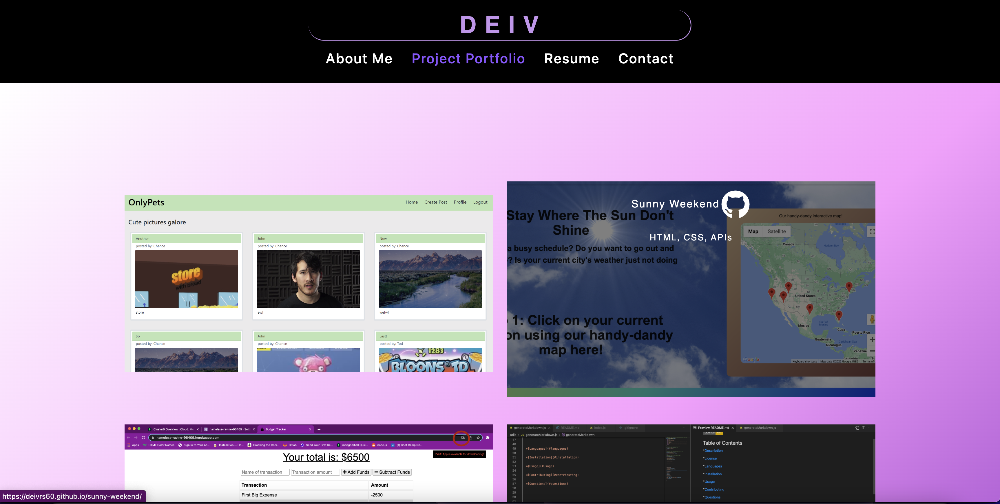

# deiv-react-portfolio
# Deiv's React Portfolio!
  
  
  ## Table of Contents ##
  *[Description](#description)

  *[License](#license)

  *[Languages](#languages)

  *[Installation](#installation)

  *[Usage](#usage)

  *[Contributing](#contributing)

  *[Questions](#questions)

  ## Description ##
  A portfolio designed to showcase all of the abilities and skills I've learned throughout the UC Berkeley Extension Bootcamp! Made using React.JS for the Front-End functionality and Bootstrap/CSS for styling, it's come a long way from my original portfolio! Note: This has no back-end implementation yet! 
  
  
  
  

  ## License ##
  This is licensed under MIT
  

  ## Installation ##
  npm i

  ## Tests ##
  npm test

  ## Usage ##
  In order to get all of the required dependencies, type `NPM I` into your console once in the root of the directory. Once that is completed, CD into the client folder and run `NPM I` again. This is an issue i tried fixing but it broke the application for a bit. It was because of how I started the base of the app!

  ## Contributing ##
  There's code in here. Be careful.

  ## Questions ##
  Github: [DEIVRS60](https://github.com/DEIVRS60)

  Email: david.reyes095@gmail.com

  
